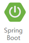
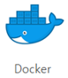
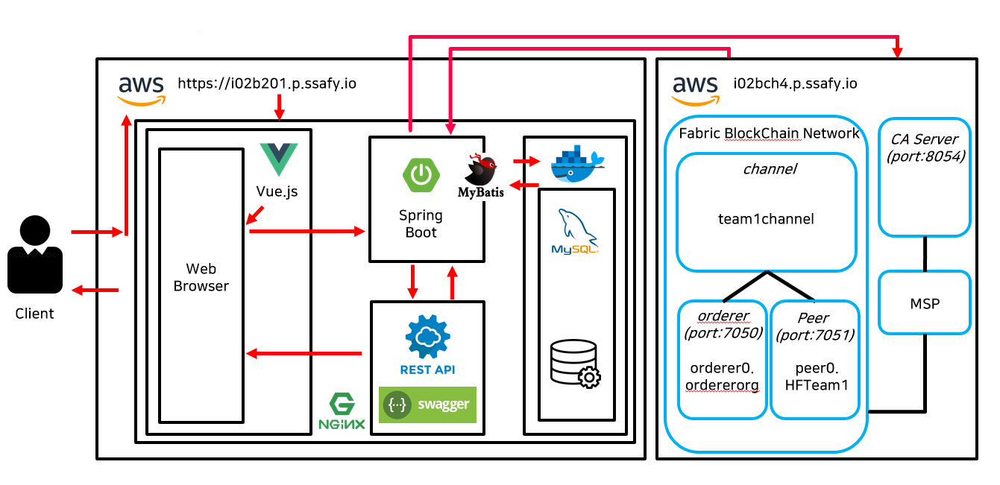
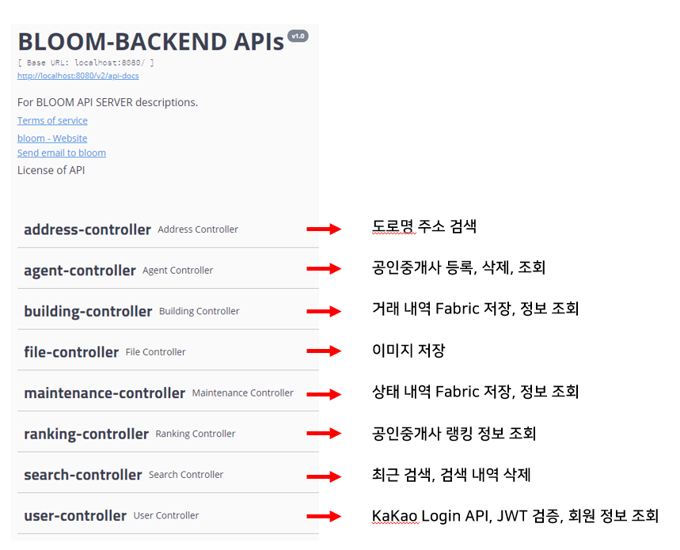

<center><center>
<br/>

# 													[**:cherry_blossom:** BLOOM ](https://i02b201.p.ssafy.io/) 

<center><b> 하이퍼레저 패브릭</b>을 이용한 <b>부동산 이력 조회</b>, <b>BLOOM</b>은 신뢰성 있는 내역을 제공합니다.</center> <br/><br/>
<p align = "center"> 📱💻🖥 </p>
<center><b>Supported Skills & Architecture</b></center>
|  |      |    |       |
| :--------------------------------------------------: | :----------------------------------------------------: | :---------------------------------------------------: | :----------------------------------------------------------: |
|      |      |  |  |
|      |  |    |         |
|     |     |    |                                                              |

<br/>

------

<br/>

|  |  |
| --------------------------------------------------------- | -------------------------------------------------------- |
|     |  |

<br/>

<br/>

------

<br/>


<br/>

- **KAKAO 로그인**: ***OAuth2.0***과 ***JWT***를 사용하여 간편하지만 안전한 로그인 기능을 제공합니다.
- **Hyperledger Fabric**을 이용한 **부동산 분산원장 플랫폼**
- **부동산 이력** (매매, 전세, 월세, 임대) 및 **유지보수이력** (시설, 환경, 유지) 관리
- **검색어 자동완성** 및 **최근 검색어** 서비스 제공
- **KAKAO MAP**을 활용한 위치 기반 서비스 제공
- 공인중개사들의 **실시간 랭킹** 정보 제공

<br/>

<br/>

<center></center>
<center><center>
<br/>

<br/>

<center><center>
<br/>


<br/>

<br/>

## **:chains:** 부동산 및 유지보수 이력 Chaincode

```javascript
var buildingInfo = {
    num: args[0],
    address: args[1],
    dong: args[2],
    ho: args[3],
    latitude: args[4],
    longitude: args[5],
    supply: args[6],
    exclusive: args[7],
    details: args[8],
    cost: args[9],
    startDate: args[10],
    endDate: args[11],
    name: args[12],
    license: args[13],
    image: args[14],
    createdAt: timestampString,
    expiredAt: args[15],
};
```

<br/>

```javascript
 인덱스 : (B2048)
 주소 : (대전광역시 00구 00동 00번지 300호)
 위치 : (36,47481592, 127.31362729)
 면적 : (7평)
 계약 기간 : (2020.04.01~2020.04.01)
 비고 : (월세, 전세, 임대, 매매)
 계약비용 : (000만원)
 계약 날짜 : (2020.04.01)
 임대인 : (홍길동)
 공인중개사 : (172875827936)
 사진 : (default.png)
 만료 여부 : (True/ False)
```

<br/>

<br/>

```javascript
var maintenanceInfo = {
    num: args[0],
    address: args[1],
    dong: args[2],
    ho: args[3],
    latitude: args[4],
    longitude: args[5],
    category: args[6],
    details: args[7],
    cost: args[8],
    license: args[9],
    image: args[10],
    startDate: args[11],
    endDate: args[12],
    createdAt: timestampString,
    expiredAt: args[14],
};
```

<br/>

```javascript
 인덱스 : (M2048)
 주소 : (대전광역시 00구 00동 00번지 300호)
 위치 : (36,47481592, 127.31362729)
 유형 : [시설, 환경, 유지]
 계약 기간 : (2020.04.01~2020.04.01)
 비고 : (유지보수 상세내용)
 계약비용 : (000만원)
 공인중개사 : (172875827936)
 사진 : (default.png)
 날짜 : (2020.04.01)
 만료 여부 : (True/ False)
```

<br/>

<br/>

<br/>

## 🏃 Quick Start

#### Front-end (Vue)

:one:  **npm install** 명령어를 실행시켜 주세요.

:two:  **npm run serve** 명령어를 실행시켜 주세요.

:three: ​ **index.js** baseUrl을 http://localhost:8080/ 으로 설정해주세요.

<br/>

#### Back-end (Springboot)

:recycle:   ​https://projectlombok.org/download **lombok**을 다운로드 후, dependency를 추가해주세요.

```java
    <dependency>
        <groupId>org.projectlombok</groupId>
        <artifactId>lombok</artifactId>
        <scope>provided</scope>
    </dependency>

```

✅  **bloom.main** 경로에 있는 **Application**을 실행시켜주세요.

<br/>

<br/>

<br/>

<center></center>
